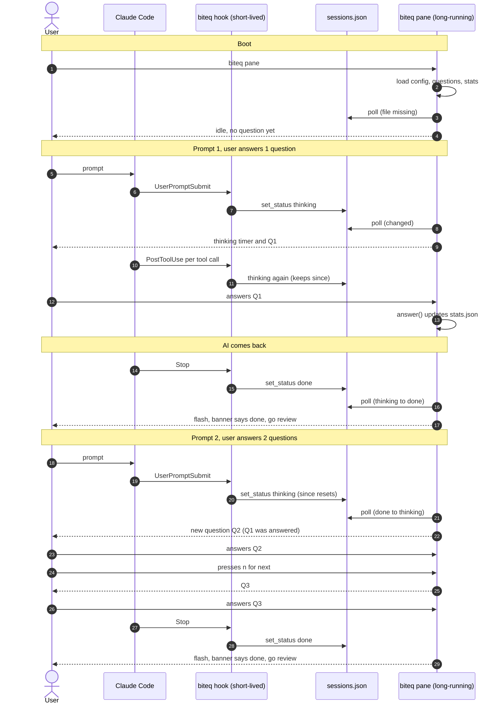

# biteq flow: boot, two prompts, three questions

This traces one run through the code as it works today:

1. Boot the pane.
2. Prompt the AI; the user answers **1** question.
3. The AI comes back.
4. Prompt the AI again; the user answers **2** questions.

Two processes are involved, and they only talk through `~/.biteq/sessions.json`:

- **Hook process.** Claude Code starts a short-lived `biteq hook` for each event. It writes `sessions.json`.
- **Pane process.** One long-running `biteq pane` polls `sessions.json` about every 250 ms and draws the UI.

> **Not paused on done.** When the AI finishes, the banner changes to "done, go review" and the screen flashes.
> The question on screen stays, and the keys still work. Pause-on-done was dropped from V0 scope.

## Diagram

## Timeline

Paths are relative to `plugins/biteq/`. Rows are in the order they happen.

| File | Method called | Explanation |
|---|---|---|
| `bin/biteq` | module top level, then `cli.main()` | **1. Boot.** You run `biteq pane`. It isn't the `hook` fast path, so it hands off to `main()`. No hook has run yet, and `sessions.json` doesn't exist. |
| `lib/biteq/cli.py` | `main()` then `cmd_pane()` | Parses arguments. There's no `--lang`, so the languages come from config. |
| `lib/biteq/quiz.py` | `language_counts()` (calls `bank_files()` and `load_bank()`) | Counts the questions in each `data/questions/*.json`. Used to validate the language choice. |
| `lib/biteq/config.py` | `get_langs()` then `load()` | Reads `~/.biteq/config.json` through `store.load_json`. Nothing saved yet, so it defaults to `["python"]`. |
| `lib/biteq/quiz.py` | `load_questions(["python"])` | Returns the 12 Python questions, each tagged `lang: "python"`. If this were empty, the pane would exit with an error. |
| `lib/biteq/pane.py` | `Pane.__init__()` calling `quiz.load_stats()` | Builds the pane. Loads `stats.json`, or the defaults if the file doesn't exist. No question is selected yet. |
| `lib/biteq/cli.py` | `curses.wrapper(Pane.run)` | Hands the terminal to curses. From here `run()` loops every 250 ms: `poll()`, `paint()`, then wait for a key. |
| `lib/biteq/pane.py` | `Pane.poll()` | `sessions.json` is missing, so the modified time is treated as 0. `store.aggregate()` returns `idle`. Nothing else happens. |
| `lib/biteq/pane.py` | `Pane.paint()` then `render()` | Draws "○ idle" and "No question yet. Prompt your AI agent...". |
| `hooks/hooks.json` | `UserPromptSubmit` runs `python3 bin/biteq hook` | **2. Prompt 1.** You submit a prompt in Claude. Claude Code runs the registered command and sends the event as JSON on stdin. |
| `bin/biteq` | hook fast path, then `cli.hook_main(argv)` | Sees `argv[1] == "hook"`. Everything is wrapped in `try/except` and ends in `sys.exit(0)`, so it never prints or blocks Claude. |
| `lib/biteq/cli.py` | `hook_main()` | Reads stdin and parses the JSON. Logs the raw payload first if `BITEQ_DEBUG=1`. Picks the Claude adapter, because the source defaults to `claude`. |
| `lib/biteq/claude.py` | `parse(data)` | `UserPromptSubmit` maps to `(session_id, "thinking", cwd)`. |
| `lib/biteq/store.py` | `set_status()` then `save_json()` | Takes the file lock, loads `sessions.json`, drops stale sessions, and records `thinking` with `since = now`. Writes via a temp file and `os.replace` so the pane never reads a half-written file. |
| `lib/biteq/pane.py` | `Pane.poll()` | Within 250 ms the file's modified time has changed. `aggregate()` returns `thinking`. This session is new, so `stats["waits"]` goes up by 1, `engaged` resets to false, and `stats.json` is saved. |
| `lib/biteq/pane.py` | `Pane.next_question()` | No question yet, so it picks Q1: usually a random unseen one, and 30% of the time one you previously missed. |
| `lib/biteq/pane.py` | `Pane.paint()` then `render()` | Draws "● AI is thinking 0:03", with the timer counting up from `since`, plus Q1 and its options. |
| `hooks/hooks.json` | `PostToolUse` runs the same hook chain | While the AI works, every tool call fires this. `set_status("thinking")` finds the same status, so `since` is kept and only `updated` moves. `poll()` sees no status change and does nothing. |
| `lib/biteq/pane.py` | `Pane.run()` then `Pane.answer(idx)` | **3. User answers Q1.** The user presses `a`–`d`. `answer()` records answered, correct, streak, `by_lang`, and the seen and wrong lists. This is the first answer during this wait, so `engaged_waits` goes up by 1. Saves `stats.json`. |
| `lib/biteq/pane.py` | `Pane.paint()` then `render()` | Shows ✓ or ✗ on the options, "Correct!" or "Not quite.", the explanation, and the footer "n/space next". |
| `hooks/hooks.json` | `Stop` runs the same hook chain (`hook_main`, `parse`, `set_status`) | **4. AI comes back.** `parse` maps `Stop` to `done`. `set_status` records `done` with a new `since`. |
| `lib/biteq/pane.py` | `Pane.poll()` | The status went from `thinking` to `done`, so `poll()` returns `True`. `aggregate()` now reports `done`. |
| `lib/biteq/pane.py` | `Pane.run()` calling `curses.flash()`, then `paint()` | The screen flashes. The banner changes to "✓ AI is done, go review". Q1 and its explanation stay on screen, and the keys still work (see the note at the top). |
| `hooks/hooks.json` | `UserPromptSubmit` runs the same hook chain | **5. Prompt 2.** `set_status("thinking")` sees a status change from `done`, so `since` resets to now. |
| `lib/biteq/pane.py` | `Pane.poll()` then `next_question()` | `done` to `thinking` counts as a new wait: `waits` goes up by 1 and `engaged` resets. Q1 was already answered (`picked` is set), so a fresh question Q2 is chosen. An unanswered question would have been kept. |
| `lib/biteq/pane.py` | `Pane.paint()` then `render()` | The banner is back to "● AI is thinking", with the timer restarted, and shows Q2. |
| `lib/biteq/pane.py` | `Pane.run()` then `Pane.answer(idx)` | **6. User answers 2 questions.** The user answers Q2. `engaged` was reset, so `engaged_waits` goes up by 1 again. |
| `lib/biteq/pane.py` | `Pane.run()` then `Pane.next_question()` | The user presses `n` or space. This is allowed because the current question is answered. Q3 is picked, different from Q2. |
| `lib/biteq/pane.py` | `Pane.run()` then `Pane.answer(idx)` | The user answers Q3. `engaged` is already true for this wait, so `engaged_waits` does not change. `answered` goes up and `stats.json` is saved. |
| `hooks/hooks.json` | `Stop` runs the same hook chain | **7. AI comes back again.** The status goes to `done`, the pane flashes, and the banner says "done, go review". |

## Totals after this run

| Counter | Value | Why |
|---|---|---|
| `answered` | 3 | Q1, Q2, and Q3 |
| `waits` | 2 | Two separate times a session went into `thinking` |
| `engaged_waits` | 2 | You answered at least one question in each wait. Q3 shared a wait with Q2, so it counts once. |

`biteq stats` reports the ratio of `engaged_waits` to `waits`, which is the metric the project tracks: the share of AI waits where you practiced.

## Events not shown above

- **`Notification` with `permission_prompt`** sets the status to `waiting` (Claude needs your input). `PostToolUse` then flips it back to `thinking`.
- **`PreToolUse` for `AskUserQuestion` or `ExitPlanMode`** also sets `waiting`.
- **`SessionEnd`** removes the session from `sessions.json`.
- **`Notification` with `idle_prompt`** sets `done`. It covers an interrupted session, because `Stop` doesn't fire when you press Esc.
- **No `SessionStart` hook** exists yet. The pane doesn't know a Claude session exists until the first prompt, and nothing opens the pane automatically (`macos.py` is a stub).
