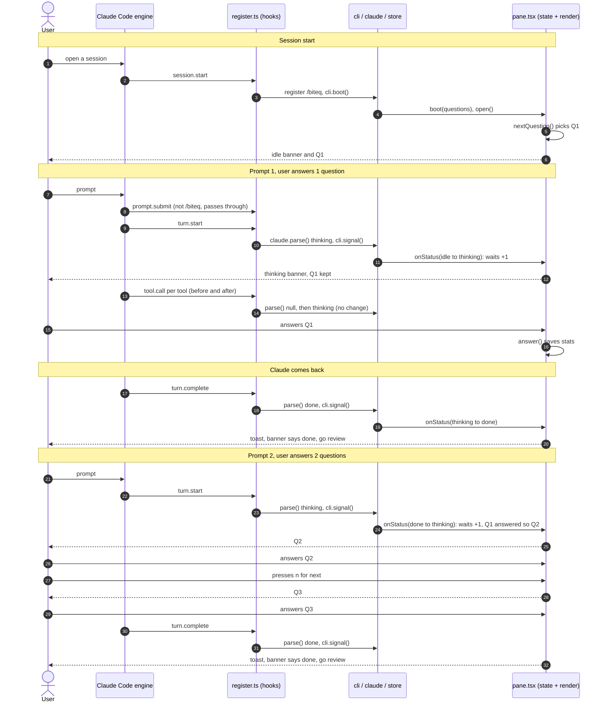
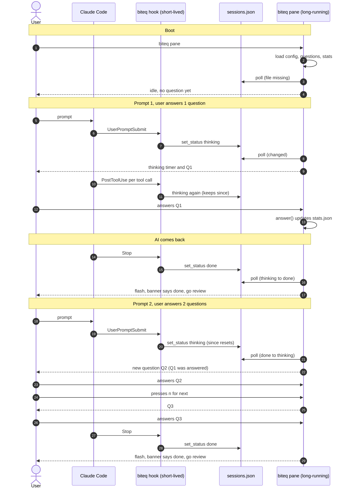

# biteq flow: boot, two prompts, three questions

This traces one run through the code as it works today, in the TypeScript plugin (`plugins/biteq-ts`),
which runs inside Claude Code:

1. Start a Claude Code session; the pane opens.
2. Prompt Claude; the user answers **1** question.
3. Claude comes back.
4. Prompt Claude again; the user answers **2** questions.

The Python plugin (`plugins/biteq`) is still in the repo until the migration is finished; its trace of the
same run is in the collapsed section at the end of this page.

There is **one process**: the Claude Code session itself. Claude Code loads the plugin into its own
engine and calls its hooks directly, so there's no hook process, no `sessions.json` and no polling.

- **`hooks/register.ts`** receives every engine event and is the only file that touches the engine's `$`.
  It builds an `io` object (`hooks/biteq/io.ts`) and calls the modules with it.
- **Session state** (`$.state`: status, since, current (the question and the option picked), engaged, dismissed,
  stats) is what the pane draws from. Writing a value redraws the pane. It lasts for the session and survives a hot reload.
- **The plugin store** (`$.store`, a JSON file under `~/.claude/plugins/store/`) keeps `stats` and `config`
  across sessions. Python's `~/.biteq/stats.json` and `config.json` hold the same shapes.

> **Not paused on done.** When Claude finishes, the banner changes to "done, go review" and a toast appears.
> The question on screen stays, and the keys still work. Pause-on-done was dropped from V0 scope.

## Diagram

## Timeline

Paths are relative to `plugins/biteq-ts/`. Rows are in the order they happen.

| File | Method called | Explanation |
|---|---|---|
| `hooks/hooks.json` | names `./register.ts` | **1. Session start.** You open Claude Code with the plugin (installed, or `--plugin-dir ./plugins/biteq-ts`). The engine loads the module and calls `register(on)`, which registers every hook. |
| `hooks/register.ts` | `on('session.start')` | Registers the `/biteq` command (`cli.COMMAND`), calls `cli.boot(io($))`, and starts a once-a-second `pane.tick()` for the thinking timer. This also runs again after every hot reload. |
| `hooks/biteq/cli.ts` | `boot()` then `cmdPane(io, undefined, false)` | Python's `cmd_pane()`. There's no `--lang`, so the languages come from config. `false` means the pane opens without taking the keyboard. |
| `hooks/biteq/quiz.ts` | `languageCounts()` (calls `bankFiles()` and `loadBank()`) | Counts the questions in each `data/questions/*.json` through `io.list` and `io.read`. Used to validate a language choice. |
| `hooks/biteq/config.ts` | `getLangs()` then `load()` | Reads the store's `config` key through `store.loadJson`. Nothing saved yet, so it defaults to `["python"]`. |
| `hooks/biteq/quiz.ts` | `loadQuestions(["python"])` | Returns the 12 Python questions, each tagged `lang: "python"`. If this were empty, `/biteq` would reply with an error and the pane would stay closed. |
| `hooks/biteq/pane.tsx` | `boot()` calling `quiz.loadStats()` | Keeps the question list and copies the stored stats into session state. |
| `hooks/biteq/pane.tsx` | `open(io, false)` | Clears `dismissed` and calls `io.openPane()` (`$.ui.open`). The desktop app docks the pane. A terminal docks it at 144+ columns, otherwise it waits until the window is wide enough or you type `/biteq`. No question yet, so it calls `nextQuestion()`. |
| `hooks/biteq/pane.tsx` | `advance()` calling `pick()` | Picks Q1: usually a random unseen one, and 30% of the time one you previously missed. Unlike Python, the first question appears at boot, not at the first prompt. |
| `hooks/register.ts` | `on('ui.render')` calling `pane.view()` then `pane.render()` | `view()` reads session state (which subscribes the pane to it); `render()` draws "○ idle" and Q1 with its options. |
| `hooks/register.ts` | `on('prompt.submit')` calling `cli.typedArgs()` | **2. Prompt 1.** You submit a prompt. It isn't `/biteq`, so it passes through to Claude unchanged. (A typed `/biteq` would run here and never reach Claude; see below.) |
| `hooks/register.ts` | `on('turn.start')` then `claudeEvent()` | Logs the event if `BITEQ_DEBUG=1` (`debug.logEvent`), then hands `{ event: 'turn.start' }` to `claude.parse()`. |
| `hooks/biteq/claude.ts` | `parse()` | `turn.start` maps to `thinking`. Python's `parse` maps `UserPromptSubmit` the same way. |
| `hooks/biteq/cli.ts` | `signal()` | Every status goes through here (Python: `hook_main` then the pane's `poll`). It calls `store.setStatus()`, then `pane.onStatus()` with the old and new status. |
| `hooks/biteq/store.ts` | `setStatus()` | Status `idle` → `thinking`: writes `status` and sets `since` to the engine clock's now. Returns the previous status. |
| `hooks/biteq/pane.tsx` | `onStatus(idle, thinking)` | A new wait: `engaged` resets to false and `waits` goes up by 1 (`quiz.saveStats` re-reads the store first, so two sessions don't erase each other). Q1 isn't answered yet, so it's kept. Reopens the pane unless you closed it. |
| `hooks/biteq/pane.tsx` | `render()`, then `tick()` every second | Redraws because state changed: "● Claude is thinking 0:00" and Q1. While the status is `thinking`, `tick()` asks for a redraw each second, so the timer counts up (Python repaints every 250 ms). |
| `hooks/register.ts` | `on('tool.call')`: `claudeEvent` before and after `next(e)` | While Claude works, every tool call fires this. Before: `parse` returns `null` for an ordinary tool, so nothing happens. After: `parse` returns `thinking`, `setStatus` finds the same status, and `onStatus` does nothing. |
| `hooks/register.ts` | `on('ui.press')` calling `pane.press(key)`, then `answer(qid, idx)` | **3. User answers Q1.** The user clicks an option, or in the terminal presses `a`–`d` after `ctrl+x tab` gives the pane the keyboard (the desktop app shows no key hints: its keys stay in the message box). Each Button's key names its action and question (`answer:0:python-…`). The `ui.press` hook acts on that key and answers the press itself, because the Buttons' own handlers change with every redraw and the desktop app can send a click from the previous drawing (logged as `ui_press not handled`). `answer()` first writes the pick into `current` (one write, so the pane redraws at once), only if that question is still on screen and unanswered (so a second click can't count twice). Then it records answered, correct, streak, `by_lang`, and the seen and wrong lists. This is the first answer during this wait, so `engaged_waits` goes up by 1. Saves `stats`. |
| `hooks/biteq/pane.tsx` | `render()` | Shows ✓ or ✗ on the options, "Correct!" or "Not quite.", the explanation, and a **Next** button (`n`). |
| `hooks/register.ts` | `on('turn.complete')` then `claudeEvent()` | **4. Claude comes back.** No `agentId` (a subagent finishing is ignored), so `parse` maps it to `done`. |
| `hooks/biteq/pane.tsx` | `onStatus(thinking, done)` | Shows the toast "biteq: Claude is done, go review" (Python flashes the screen). The banner changes to "✓ Claude is done, go review". Q1 and its explanation stay, and the keys still work. |
| `hooks/register.ts` | `on('turn.start')`, same chain | **5. Prompt 2.** `parse` → `thinking`; `setStatus` sees a change from `done`, so `since` resets to now. |
| `hooks/biteq/pane.tsx` | `onStatus(done, thinking)` then `advance()` | `done` → `thinking` counts as a new wait: `waits` goes up by 1 and `engaged` resets. Q1 was already answered (`picked` is set), so a fresh question Q2 is chosen. An unanswered question would have been kept. |
| `hooks/biteq/pane.tsx` | `render()` | The banner is back to "● Claude is thinking", with `since` restarted, and shows Q2. |
| `hooks/biteq/pane.tsx` | `answer(idx)` | **6. User answers 2 questions.** The user answers Q2. `engaged` was reset, so `engaged_waits` goes up by 1 again. |
| `hooks/biteq/pane.tsx` | `press('next:<Q2 id>')` then `next(qid)` | The **Next** button, through the same `ui.press` hook. Q3 is picked, different from Q2, in one write to `current`, and only if Q2 is still on screen (so a double click moves on once). **Skip** does the same before answering. |
| `hooks/biteq/pane.tsx` | `answer(idx)` | The user answers Q3. `engaged` is already true for this wait, so `engaged_waits` does not change. `answered` goes up and `stats` is saved. |
| `hooks/register.ts` | `on('turn.complete')`, same chain | **7. Claude comes back again.** The status goes to `done`, the toast appears, and the banner says "done, go review". |

## Totals after this run

| Counter | Value | Why |
|---|---|---|
| `answered` | 3 | Q1, Q2, and Q3 |
| `waits` | 2 | Two separate times the session went into `thinking` |
| `engaged_waits` | 2 | You answered at least one question in each wait. Q3 shared a wait with Q2, so it counts once. |

`/biteq stats` reports the ratio of `engaged_waits` to `waits`, which is the metric the project tracks: the share
of AI waits where you practiced.

## Events not shown above

- **`tool.call` for `AskUserQuestion` or `ExitPlanMode`**: `parse` returns `waiting` before the tool runs (toast
  "Claude needs your input"), and `thinking` once it returns, so answering a question or approving or rejecting
  a plan resumes the banner. Python's `PreToolUse` sets `waiting` but has no event for the answer.
- **`classic.Notification` with `permission_prompt`** sets `waiting`. The `tool.call` "after" step flips it back
  to `thinking`.
- **`classic.Notification` with `idle_prompt`** sets `done`.
- **Interrupts.** Pressing Esc still fires `turn.complete` (`reason: 'aborted'`), so the status goes to `done`.
  Python relies on `idle_prompt` for this, because `Stop` doesn't fire on interrupt.
- **Session end.** Nothing to clean up: the state belongs to the session. Python removes the session from
  `sessions.json` on `SessionEnd`.
- **Closing the pane.** Closing it (`q`, or the surface's own close) sets `dismissed` via `pane.closed()`, so the
  pane stays closed on later prompts until `/biteq` opens it again.
- **`/biteq` commands.** In the terminal, `on('command.run')` calls `cli.run()`. The desktop Code tab may not
  list a command the plugin registered after it started; then `/biteq` arrives as a prompt, and
  `on('prompt.submit')` runs `cli.run()` and drops the prompt, so it never reaches Claude.
- **Hot reload.** Saving a plugin file reloads the module: `register` runs again and `session.start` fires again
  (re-registering `/biteq` and re-running `boot`). Session state and the store are kept.

<b>Python version (plugins/biteq)</b>

The same run through the Python plugin, which stays in the repo until the migration is finished.

Two processes are involved, and they only talk through `~/.biteq/sessions.json`:

- **Hook process.** Claude Code starts a short-lived `biteq hook` for each event. It writes `sessions.json`.
- **Pane process.** One long-running `biteq pane` polls `sessions.json` about every 250 ms and draws the UI.

Paths are relative to `plugins/biteq/`. Rows are in the order they happen.

| File | Method called | Explanation |
|---|---|---|
| `bin/biteq` | module top level, then `cli.main()` | **1. Boot.** You run `biteq pane`. It isn't the `hook` fast path, so it hands off to `main()`. No hook has run yet, and `sessions.json` doesn't exist. |
| `lib/biteq/cli.py` | `main()` then `cmd_pane()` | Parses arguments. There's no `--lang`, so the languages come from config. |
| `lib/biteq/quiz.py` | `language_counts()` (calls `bank_files()` and `load_bank()`) | Counts the questions in each `data/questions/*.json`. Used to validate the language choice. |
| `lib/biteq/config.py` | `get_langs()` then `load()` | Reads `~/.biteq/config.json` through `store.load_json`. Nothing saved yet, so it defaults to `["python"]`. |
| `lib/biteq/quiz.py` | `load_questions(["python"])` | Returns the 12 Python questions, each tagged `lang: "python"`. If this were empty, the pane would exit with an error. |
| `lib/biteq/pane.py` | `Pane.__init__()` calling `quiz.load_stats()` | Builds the pane. Loads `stats.json`, or the defaults if the file doesn't exist. No question is selected yet. |
| `lib/biteq/cli.py` | `curses.wrapper(Pane.run)` | Hands the terminal to curses. From here `run()` loops every 250 ms: `poll()`, `paint()`, then wait for a key. |
| `lib/biteq/pane.py` | `Pane.poll()` | `sessions.json` is missing, so the modified time is treated as 0. `store.aggregate()` returns `idle`. Nothing else happens. |
| `lib/biteq/pane.py` | `Pane.paint()` then `render()` | Draws "○ idle" and "No question yet. Prompt your AI agent...". |
| `hooks/hooks.json` | `UserPromptSubmit` runs `python3 bin/biteq hook` | **2. Prompt 1.** You submit a prompt in Claude. Claude Code runs the registered command and sends the event as JSON on stdin. |
| `bin/biteq` | hook fast path, then `cli.hook_main(argv)` | Sees `argv[1] == "hook"`. Everything is wrapped in `try/except` and ends in `sys.exit(0)`, so it never prints or blocks Claude. |
| `lib/biteq/cli.py` | `hook_main()` | Reads stdin and parses the JSON. Logs the raw payload first if `BITEQ_DEBUG=1`. Picks the Claude adapter, because the source defaults to `claude`. |
| `lib/biteq/claude.py` | `parse(data)` | `UserPromptSubmit` maps to `(session_id, "thinking", cwd)`. |
| `lib/biteq/store.py` | `set_status()` then `save_json()` | Takes the file lock, loads `sessions.json`, drops stale sessions, and records `thinking` with `since = now`. Writes via a temp file and `os.replace` so the pane never reads a half-written file. |
| `lib/biteq/pane.py` | `Pane.poll()` | Within 250 ms the file's modified time has changed. `aggregate()` returns `thinking`. This session is new, so `stats["waits"]` goes up by 1, `engaged` resets to false, and `stats.json` is saved. |
| `lib/biteq/pane.py` | `Pane.next_question()` | No question yet, so it picks Q1: usually a random unseen one, and 30% of the time one you previously missed. |
| `lib/biteq/pane.py` | `Pane.paint()` then `render()` | Draws "● AI is thinking 0:03", with the timer counting up from `since`, plus Q1 and its options. |
| `hooks/hooks.json` | `PostToolUse` runs the same hook chain | While the AI works, every tool call fires this. `set_status("thinking")` finds the same status, so `since` is kept and only `updated` moves. `poll()` sees no status change and does nothing. |
| `lib/biteq/pane.py` | `Pane.run()` then `Pane.answer(idx)` | **3. User answers Q1.** The user presses `a`–`d`. `answer()` records answered, correct, streak, `by_lang`, and the seen and wrong lists. This is the first answer during this wait, so `engaged_waits` goes up by 1. Saves `stats.json`. |
| `lib/biteq/pane.py` | `Pane.paint()` then `render()` | Shows ✓ or ✗ on the options, "Correct!" or "Not quite.", the explanation, and the footer "n/space next". |
| `hooks/hooks.json` | `Stop` runs the same hook chain (`hook_main`, `parse`, `set_status`) | **4. AI comes back.** `parse` maps `Stop` to `done`. `set_status` records `done` with a new `since`. |
| `lib/biteq/pane.py` | `Pane.poll()` | The status went from `thinking` to `done`, so `poll()` returns `True`. `aggregate()` now reports `done`. |
| `lib/biteq/pane.py` | `Pane.run()` calling `curses.flash()`, then `paint()` | The screen flashes. The banner changes to "✓ AI is done, go review". Q1 and its explanation stay on screen, and the keys still work. |
| `hooks/hooks.json` | `UserPromptSubmit` runs the same hook chain | **5. Prompt 2.** `set_status("thinking")` sees a status change from `done`, so `since` resets to now. |
| `lib/biteq/pane.py` | `Pane.poll()` then `next_question()` | `done` to `thinking` counts as a new wait: `waits` goes up by 1 and `engaged` resets. Q1 was already answered (`picked` is set), so a fresh question Q2 is chosen. An unanswered question would have been kept. |
| `lib/biteq/pane.py` | `Pane.paint()` then `render()` | The banner is back to "● AI is thinking", with the timer restarted, and shows Q2. |
| `lib/biteq/pane.py` | `Pane.run()` then `Pane.answer(idx)` | **6. User answers 2 questions.** The user answers Q2. `engaged` was reset, so `engaged_waits` goes up by 1 again. |
| `lib/biteq/pane.py` | `Pane.run()` then `Pane.next_question()` | The user presses `n` or space. This is allowed because the current question is answered. Q3 is picked, different from Q2. |
| `lib/biteq/pane.py` | `Pane.run()` then `Pane.answer(idx)` | The user answers Q3. `engaged` is already true for this wait, so `engaged_waits` does not change. `answered` goes up and `stats.json` is saved. |
| `hooks/hooks.json` | `Stop` runs the same hook chain | **7. AI comes back again.** The status goes to `done`, the pane flashes, and the banner says "done, go review". |

Events not shown above (Python):

- **`Notification` with `permission_prompt`** sets the status to `waiting` (Claude needs your input). `PostToolUse` then flips it back to `thinking`.
- **`PreToolUse` for `AskUserQuestion` or `ExitPlanMode`** also sets `waiting`.
- **`SessionEnd`** removes the session from `sessions.json`.
- **`Notification` with `idle_prompt`** sets `done`. It covers an interrupted session, because `Stop` doesn't fire when you press Esc.
- **No `SessionStart` hook** exists. The pane doesn't know a Claude session exists until the first prompt, and nothing opens the pane automatically (`macos.py` is a stub).

