# biteq lesson plan: boot to a question answered

A guided read of `plugins/biteq`, in fifteen steps, for someone seeing the code for the first
time. Each step takes one small piece of the journey from the engine loading the plugin to the user
answering a question, and explains it in under 350 words.

`docs/flow.md` is the companion to this: it traces the same run as a timeline, assuming you already
know the pieces. This document builds the pieces up one at a time. Paths are relative to
`plugins/biteq/` unless stated otherwise.

**Part A — Orientation** (steps 1–4) · what the files are, how the plugin is loaded, and the two
abstractions everything else rests on.
**Part B — Boot to first paint** (steps 5–8) · from `session.start` to a pane on screen.
**Part C — Watching Claude** (steps 9–11) · how the plugin knows the agent is working.
**Part D — Answering** (steps 12–15) · the press, the write, the next question.

---

## Part A — Orientation

### Step 1 — The map: ten modules, one job each

```
plugins/biteq/
├── .claude-plugin/plugin.json   name, version, pointer to the types
├── hooks/
│   ├── hooks.json               { "modules": ["./register.ts"] }
│   ├── register.ts              THE ONLY FILE THAT TOUCHES THE ENGINE'S `$`
│   └── biteq/
│       ├── io.ts        what the modules may do, as a type
│       ├── cli.ts       /biteq subcommands, and signal(): every status goes through it
│       ├── claude.ts    engine event -> status  (pure)
│       ├── store.ts     store keys, JSON helpers, this session's status
│       ├── pane.tsx     questions, answering, render()
│       ├── quiz.ts      question banks, stats, validation
│       ├── config.ts    remembered languages
│       ├── debug.ts     BITEQ_DEBUG event log
│       └── macos.ts     stubs, nothing calls them
├── types/index.d.ts             the session-state contract
└── data/questions/*.json        8 banks: bash cs git js python ruby sql ts
```

Each module has one job, named after it. `io.ts` is the odd one out: it holds no logic of its own, and
step 3 explains why it has to exist.

The rule worth memorising now, because it shapes everything else: **only `register.ts` touches
`$`**, the engine handle. Every other module is handed an `io` object instead and never imports
anything from `claude-code`. That is not a style preference; the engine refuses to let `$` cross an
import, and step 3 covers what that means in practice.

Two files are not code and are easy to overlook. `types/index.d.ts` declares the shape of the
plugin's session state, which is what makes `io.get('stats')` return `Stats` rather than `unknown`.
`data/questions/*.json` is the content: one file per language, and the filename *is* the language
tag applied to every question inside it.

### Step 2 — How the engine finds and loads the plugin

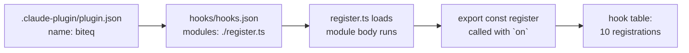

Loading has three stages, and it is worth separating them because they happen at different times
and the distinction matters later.

First the **manifest**. `.claude-plugin/plugin.json` names the plugin `biteq` — that string is
the plugin's identity everywhere: the `plugin` field of every atom address, the `e.plugin` on a
press, the folder its store file lives in. It also points at `./types/index.d.ts`, which is how the
engine knows the plugin's state contract.

Then `hooks/hooks.json`, which is one line:

```json
{ "modules": ["./register.ts"] }
```

That is the entry point. The engine loads that module and everything it imports, as ES modules —
there is no `require`, and a file with a suffix outside the allowed set simply is not loaded.

Loading the module **runs its top level**. That is when the six `atom(...)` calls at
`register.ts:33-38` build their descriptors. Nothing has been registered yet and no hook has fired.

Finally the engine calls the module's `register` export:

```ts
export const register: Register = on => { ... }
```

`on(event, handler)` or `on(event, matcher, handler)` adds one link to the chain for that event.
`biteq` makes ten such calls. `register` returns nothing useful; its whole purpose is the side
effect of those registrations.

One thing to carry forward: **all of this happens again on a hot reload**. Saving any plugin file
re-evaluates the module, rebuilds the atoms, and re-runs `register`. Session state survives that,
the atom objects do not.

### Step 3 — `io($)`: the function you asked about

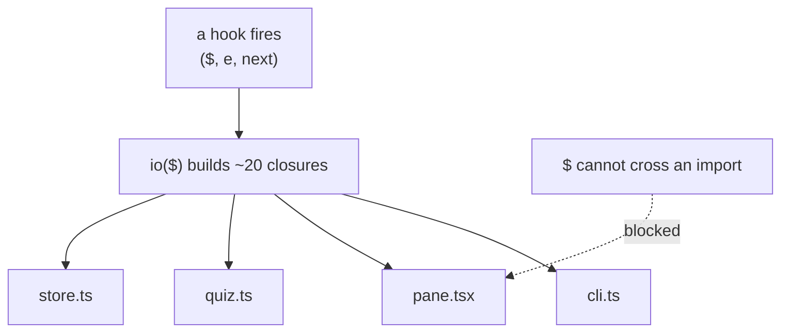

This is the abstraction the whole codebase is built around, so it is worth getting exactly right.

`$` is the engine handle a hook receives as its first argument. It is the only way to reach the
filesystem, the store, the UI, the clock — the plugin environment has no `fs`, no network, no
`process` of its own. And the engine will not let `$` be passed across an import boundary: it is
usable only in the file whose hook received it.

That is a problem, because `pane.tsx` needs to read state and `quiz.ts` needs to read files. The
answer is `io($)` at `register.ts:40-89`: a function that takes `$` and returns a plain object of
small closures, each one capturing `$`:

```ts
storeGet: key => $.store.get(key),
read: async path => String(await $.fs.read(path)),
now: () => $.clock.now(),
```

The object is ordinary data, so it *can* cross imports. Every other module takes it as its first
parameter — `boot(io)`, `answer(io, qid, idx)`, `loadStats(io)` — and never sees `$` at all.

`io.ts` is the matching type. It does not implement anything; it declares what the modules are
allowed to do, grouped by kind: `storeGet`/`storeSet` for across-session storage, `get`/`set` for
this session's state, `list`/`read`/`write`/`exists` for files, `openPane`/`toast`/`redraw` for the
UI, `now` for the clock.

Two consequences worth noticing. Every hook builds a **fresh** `io` — you will see `io($)` written
inline at each call site rather than stored in a variable, because `$` belongs to that dispatch.
And because modules depend on a plain object rather than the engine, they can be tested by passing
a hand-written `io`.

### Step 4 — The state contract: a declaration, six atoms, and two switches

```
types/index.d.ts                register.ts                     io()
─────────────────               ───────────                     ────
PluginState['biteq'] = {     const status  = atom(...)       get: key => switch (key) {
  status:    Status         ──▶ const since   = atom(...)   ──▶   case 'status': read($, status)
  since:     number             const current = atom(...)         case 'since':  read($, since)
  current:   Current            const engaged = atom(...)         ...
  engaged:   boolean            const dismissed = atom(...)     }
  dismissed: boolean            const stats   = atom(...)
  stats:     Stats
}
```

Three layers describe one thing, and each exists for a different reason.

`types/index.d.ts` **declares** the contract by augmenting the engine's `PluginState` interface.
This is types only — no runtime effect. Its job is to make `io.get('stats')` return `Stats`, and to
make a typo like `io.get('statz')` a compile error.

`register.ts:33-38` **names** the six values as atoms. An atom is an address plus a default; it
holds no value itself. The `as const` on each is required so TypeScript narrows `'biteq'` and
`'status'` to literals and can look them up in the declaration above.

Then the **switches** in `io()` at lines 45–66. These look like boilerplate and people are tempted
to replace them with a lookup table, so it is worth knowing why they cannot be: the engine requires
every read and write to name its atom literally in source, so `read($, atoms[key])` is refused at
load. Six cases is the price. The `as unknown as Io['get']` casts on lines 53 and 66 are there
because TypeScript cannot prove the key-to-type correlation across the branches; the `Io` type
restores exactness for callers.

Why six separate values instead of one object? Because reading a value inside the render hook
subscribes the drawing to it, so a write redraws the pane. Six values means a change to `status`
does not have to carry `stats` along with it. The one place two things are deliberately bundled is
`current`, which holds `{ question, picked }` together so that answering is one write and therefore
one redraw.

---

## Part B — Boot to first paint

### Step 5 — `session.start` fires: a command, a boot, and a heartbeat

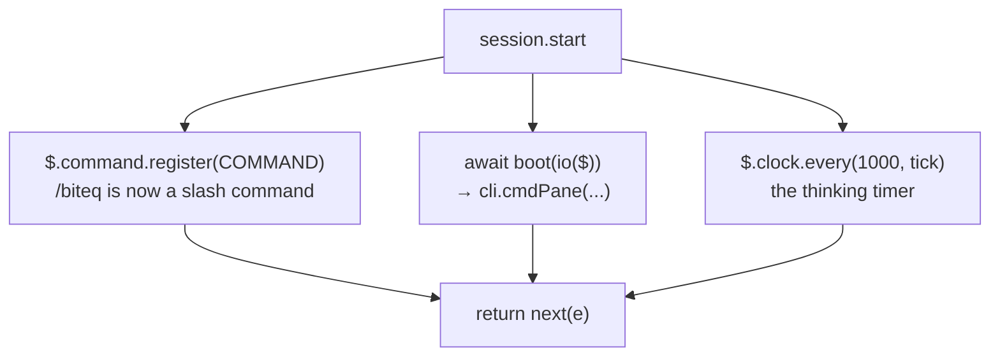

The first hook to run is at `register.ts:99-104`, and it does three unrelated things:

```ts
on('session.start', async ($, e, next) => {
  await $.command.register(COMMAND)
  await boot(io($))
  $.clock.every(1000, () => void tick(io($)))
  return next(e)
})
```

`$.command.register(COMMAND)` registers `/biteq` with its description and argument hint, defined at
`cli.ts:15-19`. From here the engine lists it in the slash-command menu and routes `/biteq …` to
the `command.run` hook.

`boot(io($))` is the interesting one and step 6 follows it in. Note the `await`: the engine awaits
the first `session.start`, so work done here is finished before turn one.

`$.clock.every(1000, ...)` starts the repeating timer that makes the elapsed-seconds counter move.
The callback stays in the plugin's environment and runs there each time the wait resolves. Note it
builds a fresh `io($)` on every tick rather than closing over one, for the reason from step 3.

Then `return next(e)`. This hook **observes** — it passes the event down the chain unchanged. Most
of `biteq`'s hooks do this; the exceptions are the ones that deliberately take over, which you will
see in steps 12 and 13.

Two details that catch people out. This hook fires **again after every hot reload**, so `/biteq` is
re-registered and `boot` re-runs — both are written to be safe to repeat. And a second
`$.clock.every` is started on each reload, which is worth knowing when you are editing the file
repeatedly in one session.

### Step 6 — `boot` → `cmdPane`: choosing languages, loading banks

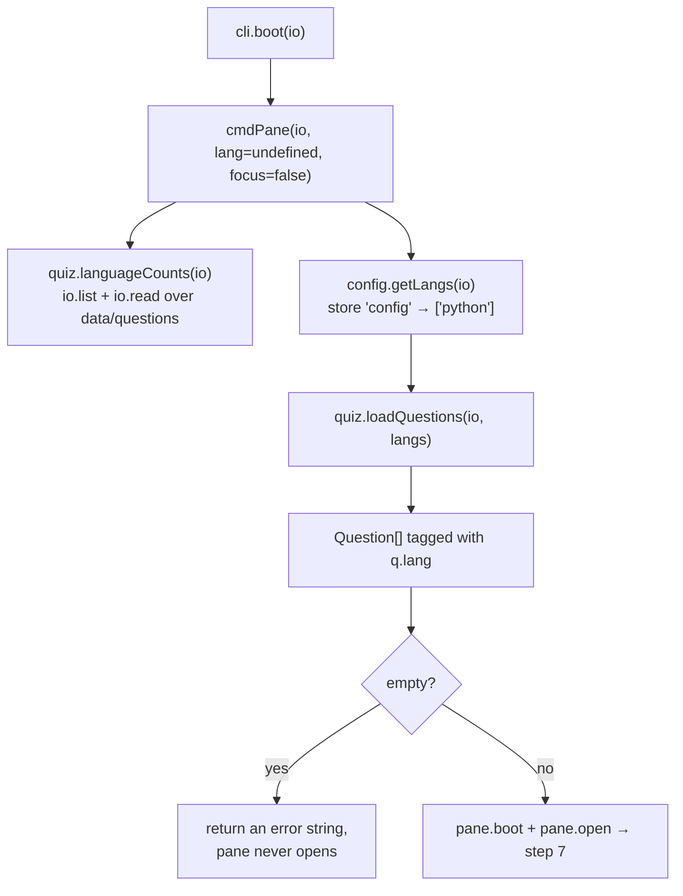

`boot` at `cli.ts:29-31` is a one-liner: it calls `cmdPane(io, undefined, false)`. The same function
backs the `/biteq` command, which is why booting and typing `/biteq` land in the same place. The
two arguments say *no explicit language* and *do not take the keyboard*.

`cmdPane` at `cli.ts:43-68` runs in four stages.

**Count what exists.** `languageCounts` walks `data/questions/` with `io.list`, keeps the `.json`
files, and reads each one to count its questions. The filename minus `.json` is the language name —
there is no language registry anywhere, the directory *is* the registry.

**Decide which languages.** No `--lang` was passed, so it calls `config.getLangs(io)`, which reads
the store's `config` key and falls back to `DEFAULT_LANGS = ['python']`. If `--lang` *had* been
given, it would be validated against the counts first, and a bad name returns an error string
without touching anything.

**Load the questions.** `loadQuestions` reads the banks for the chosen languages and tags each
question with `q.lang` from its filename. A bank that fails to parse contributes nothing rather
than throwing — `.catch(() => [])` on line 62 of `quiz.ts`.

**Bail or continue.** No questions means a message telling the user to run `/biteq langs`, and the
pane never opens. Otherwise it hands off to the pane (step 7) and returns a line of text — which
the command prints, and which boot simply discards.

Worth noticing: every file read here goes through `io`, so `quiz.ts` never knows it is talking to an
engine across a port.

### Step 7 — `pane.boot` and `open`: stats in, pane up, first question picked

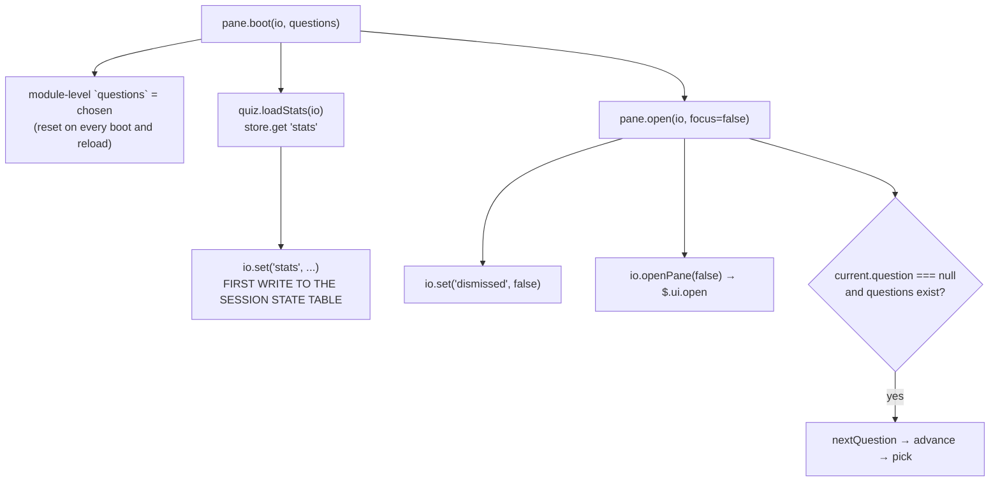

Two functions, both in `pane.tsx`.

`boot` at lines 20-24 stores the chosen questions in a **module-level variable**, not in session
state. That is deliberate: the question bank is derived from files on disk and can be rebuilt at any
time, so it does not need to survive a reload, and keeping it out of state avoids shipping the whole
bank across the port on every read. It then copies the stored stats into the `stats` atom. That
`io.set` is, in a normal session, the first entry `biteq` creates in the session state table —
everything before it was reads.

`open` at lines 117-122 does three things. It clears `dismissed`, because an explicit open overrides
a previous close. It calls `io.openPane(false)`, which is `$.ui.open` with the pane id `biteq`; the
`false` means do not take the keyboard. The result is `isPlaced` — **false is not an error**, it
means the surface has nowhere to put the pane yet, typically a terminal that is not wide enough.
The pane appears later when the window is widened.

Then, if no question is on screen, it picks one. Note this happens at boot rather than at the first
prompt.

The `placed` result flows back to `cmdPane`, which turns it into one of two messages: the "pane will
show up once this window is wide enough" warning, or a line telling the user how to interact —
`ctrl+x tab` plus key hints on a terminal, "click an answer" everywhere else. That branch is why
`io.surface()` exists.

### Step 8 — Drawing: `ui.render` → `view()` → `render()`

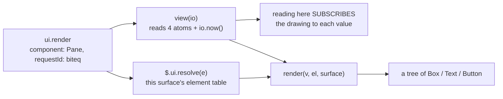

The render hook at `register.ts:145-146` is two lines and matched tightly to this plugin's own pane:

```ts
on('ui.render', { component: 'Pane', requestId: PANE }, async ($, e) =>
  render(await view(io($)), $.ui.resolve(e), e.surface))
```

`view(io)` at `pane.tsx:170-179` gathers everything the drawing needs: `current` (unpacked into
`question` and `picked`), `status`, `stats`, and `elapsedMs` computed as `io.now() - since`. Four
atom reads and a clock read. The important part is invisible: **reading a value inside a render hook
subscribes this drawing to it**. That is the mechanism that makes a later `io.set('current', …)`
redraw the pane with nobody calling invalidate. It is also why `view` is the only place these are
read together.

`$.ui.resolve(e)` returns the **element table for this surface**. Elements are not imported — `Box`,
`Text` and `Button` differ between the terminal, the desktop tab and the editor, so the surface
hands you its own constructors. This is why `render` takes `el` as a parameter.

`render` at lines 181-251 is a pure function: data in, tree out, no `io`, no engine. It draws the
status banner, the question, the options, and the buttons. Two details to note for later steps:

Each Button's `key` encodes both the action and the question — `answer:1:python-03`, `next:<id>`,
`skip:<id>`, `close`. Step 12 explains why.

Every Button's `onPress` is `handled`, an empty function. The handlers are deliberately *not* where
the work happens. Step 12 explains that too.

The `key()` helper only returns a hotkey on the terminal, because the desktop keeps keystrokes in
the message box, so key hints there would be a lie.

---

## Part C — Watching Claude

### Step 9 — The agent starts working: event → status

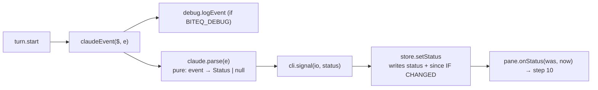

Four hooks feed this path: `turn.start`, `turn.complete`, `tool.call` and `classic.Notification`, at
`register.ts:117-137`. They all funnel into the same two-line helper, `claudeEvent`, which logs the
event when `BITEQ_DEBUG` is set and then calls `signal(it, parse(e))`.

`claude.ts` is the **adapter**, and it is pure — no `io`, no side effects, just a function from
event to `Status | null`. `null` means ignore this event. The rules are small enough to read whole:

- `turn.start` → `thinking`.
- `turn.complete` → `done`, **unless** `e.agentId` is set; a subagent finishing is not Claude being
  done.
- `tool.before` → `waiting` only for `AskUserQuestion` and `ExitPlanMode`, the tools that block on
  the person. Everything else is `null`.
- `tool.after` → `thinking`, which is what resumes the banner after a question or a permission
  prompt.
- `notification` → `waiting` for `permission_prompt`, `done` for `idle_prompt`, else `null`.

Keeping this pure is what makes the status rules testable without an engine, and it is the one file
you would rewrite to support a different agent.

`cli.signal` at `cli.ts:22-26` is the single choke point every status passes through — worth
remembering when you are hunting for where a status change came from. It drops `null`, calls
`setStatus`, then hands the old and new status to the pane.

`store.setStatus` at `store.ts:38-45` only writes **when the status actually changed**, and when it
does it also resets `since` to `io.now()`. That guard is what keeps the elapsed timer from
restarting on every tool call during a long turn.

### Step 10 — `onStatus`: counting the wait and serving a question

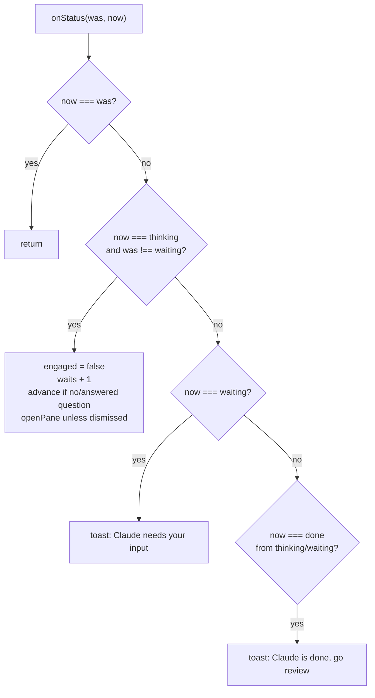

`pane.onStatus` at `pane.tsx:96-110` is where the plugin's actual product logic lives: this is the
function that decides a new AI wait has begun and that the user should be given something to do.

The `thinking` branch is the substantial one, and each line earns its place.

`engaged` resets to false — it tracks *has the user answered anything during this particular wait*,
which is the numerator of the metric the whole project exists to move.

`waits` goes up by one, through `saveStats`, which re-reads the store before changing it so two
sessions counting at the same time do not clobber each other.

A new question is served **only if** there is no question on screen, or the one there has already
been answered. An unanswered question is left alone — you do not lose your place because Claude
started a new turn.

The pane is reopened unless `dismissed` is set. That flag is how an explicit close by the person
sticks: `on('ui.close')` at `register.ts:140-143` sets it, but only when `e.origin.kind === 'person'`,
so a close the plugin or the engine caused does not count as the user saying no.

Note the `was !== 'waiting'` guard on the branch. Coming back from `waiting` to `thinking` — which
happens every time a permission prompt is answered — is a *resumption*, not a new wait. Without that
guard, approving three tool calls would count as three waits and inflate the metric.

The other two branches only raise toasts. Nothing is paused when Claude finishes: the question stays
on screen and the keys keep working.

### Step 11 — The heartbeat: one tick a second

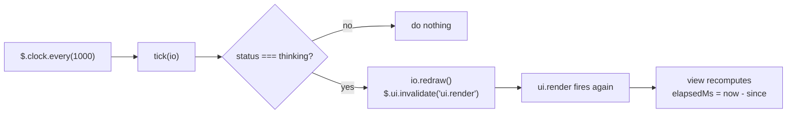

`tick` at `pane.tsx:112-114` is three lines and exists for one reason: the banner shows
`● Claude is thinking  0:07`, and nothing else would make that number change.

This is worth dwelling on because it is the clearest example of the architecture's cost. Session
state has not changed, so no subscription fires. To move the counter, the plugin has to *ask* for a
redraw with `io.redraw()`, which is `$.ui.invalidate('ui.render')`.

Follow what one tick costs. A clock dispatch wakes the plugin environment. `tick` reads `status`,
which is a `state.get` across the port. If the status is `thinking`, `io.redraw()` is another
message. That triggers a fresh `ui.render` dispatch, in which `view()` performs four `state.get`
calls and a `clock.now`, and the resulting tree crosses back. Call it ten messages a second while
Claude is working, for a counter.

The guard matters: when the status is anything other than `thinking`, `tick` costs a single read and
stops. An idle session is nearly free.

The timer redraws once a second, not more often, because each repaint is a round trip to the
engine. The counter stays correct either way — `elapsedMs` is computed from `since`, not
accumulated — it just steps once a second.

This is the part of `biteq` a `Client` surface module would most improve, by running the counter on
the surface's own frame clock with no dispatch at all. That is a future option, not a defect.

---

## Part D — Answering

### Step 12 — The press: why the handler is empty

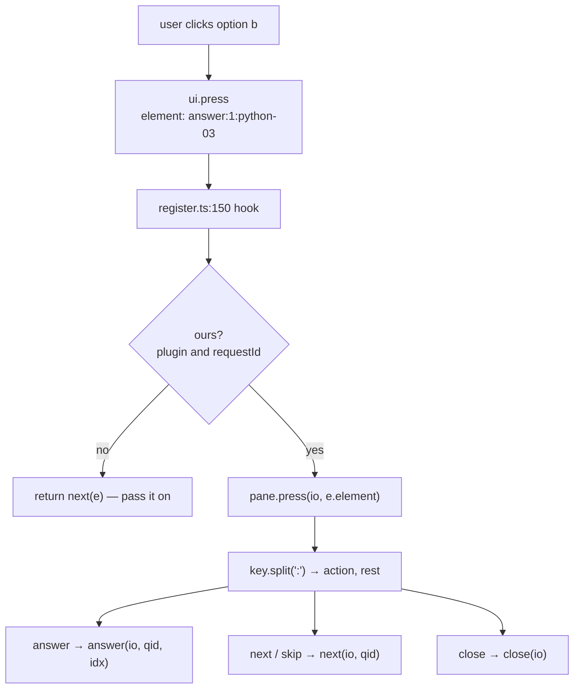

Here is the thing that confuses every reader of `pane.tsx`: every Button is drawn with
`onPress={handled}`, and `handled` is `() => {}`. The buttons appear to do nothing.

The work happens one level up, in the `ui.press` hook at `register.ts:150-154`, which acts on the
Button's **key** instead of its handler. The reason is in the comment at `pane.tsx:146-150`: every
redraw gives the Buttons new handlers, and the desktop app can deliver a click carrying the
*previous* drawing's handler. The engine then finds no handler, logs `ui_press not handled`, and the
click is lost. Since the timer redraws the pane every second (step 11), that race is not rare.

A key is stable in a way a handler is not. `answer:1:python-03` means the same thing in any drawing,
so acting on it works no matter which drawing the click came from.

That is why the keys carry structure. `pane.tsx:137-143` builds them: `answer:<idx>:<qid>`,
`next:<qid>`, `skip:<qid>`, and the bare `close`. `press` at lines 152-157 splits on `:`, reads the
action, and rejoins the rest as the question id — rejoining matters because an id could itself
contain a colon.

Notice that the question id travels **in the key**. That is what lets the handlers in step 13 check
that the question they were drawn for is still the one on screen, which is how a double click is
prevented from counting twice.

The hook currently has no matcher, so every press in the session reaches it and is passed on with
`next(e)`. That is recorded as finding F1 in `docs/review-notes.md`.

### Step 13 — `answer()`: one guarded write, then the bookkeeping

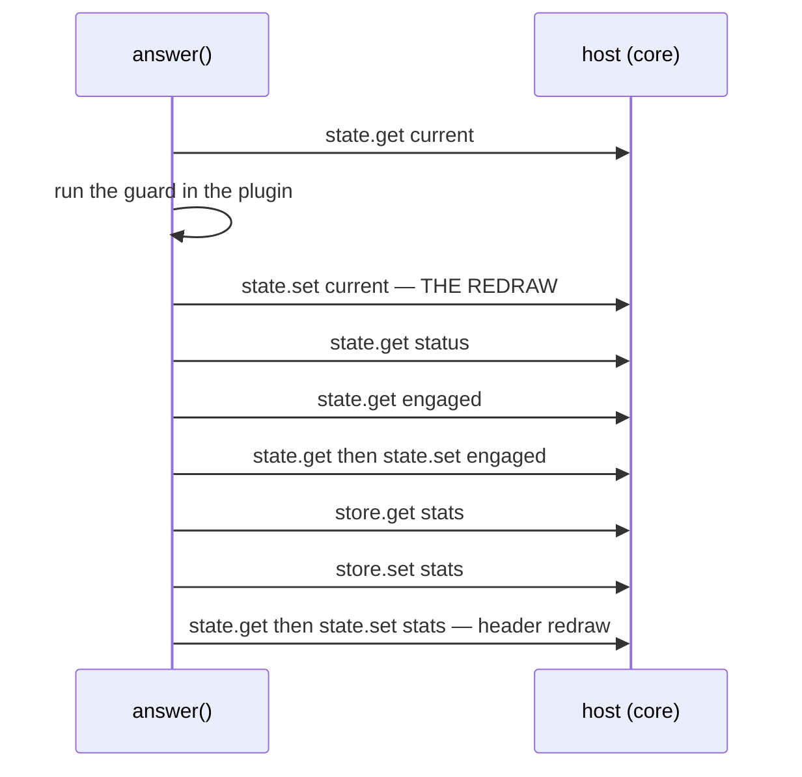

`answer` at `pane.tsx:64-93` is the most carefully written function in the codebase, and every bit of
its awkwardness is load-bearing.

It opens by writing `current` — before any scoring — because that is the write the pane is
subscribed to, so the user sees their answer marked immediately and the rest happens behind the
already-updated screen.

The guard lives **inside** the change function:

```ts
const ok = c.question?.id === qid && c.picked === null && idx < c.question.options.length
```

Three conditions: the question this press was drawn for is still on screen, it has not already been
answered, and the option index is real. Putting the test inside the updater is what makes it safe —
`update()` re-reads and retries on a version miss, so the check is re-evaluated against whatever is
actually current. A second click cannot score twice.

The `recorded` variable is the trick that makes this work. The change function cannot return two
things, so it assigns the question to a closure variable, and the code after reads it to find out
whether *this* press was the one that counted. If `recorded` is null, the function returns and
nothing is scored.

Then the metric. `counts` is true only when the status is `thinking` or `waiting` **and** `engaged`
is still false — the first answer in this wait. That is what increments `engaged_waits`.

Finally `saveStats` re-reads the store, applies every counter in one change (answered, correct,
streak, best streak, `by_lang`, `seen`, `wrong`, `engaged_waits`), writes it, and the result is
mirrored into the `stats` atom so the header's streak redraws.

### Step 14 — Moving on: `next`, `skip`, and how a question is chosen

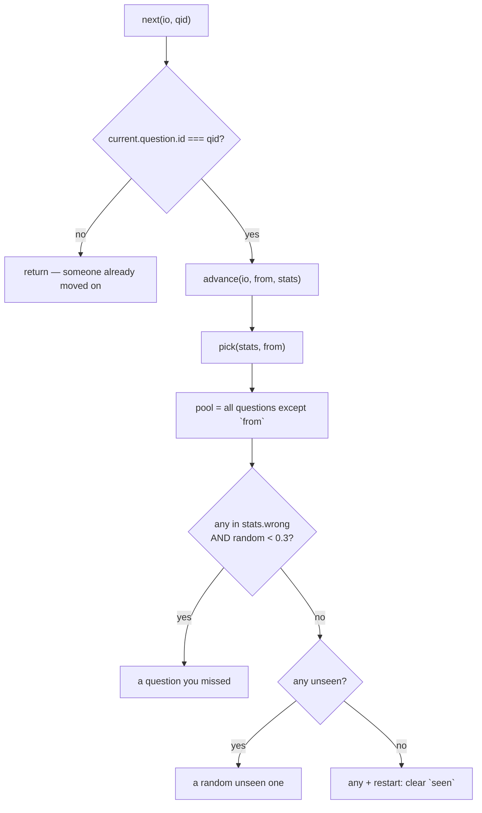

`next` at `pane.tsx:53-58` handles the Next and Skip buttons — they are the same operation, just
drawn at different times. It begins with the same staleness check as `answer`: if the question
currently on screen is not the one this button was drawn for, someone already moved on and this
press does nothing. Two fast clicks advance one question.

`advance` at lines 44-51 writes the new question into `current`, and the write itself carries the
guard a second time:

```ts
await io.set('current', c => (c.question?.id === from?.id ? { question: q, picked: null } : c))
```

If anything changed between picking and writing, the write is a no-op. Belt and braces, but cheap.

`pick` at lines 34-41 is the selection policy, and it is the product in three lines. It excludes the
current question so you never get the same one twice in a row. Then, **30% of the time**, if you
have any wrong answers on record, it serves one of those — light spaced repetition. Otherwise it
prefers a question you have never seen. If everything has been seen, it picks anything and flags
`restart`, which clears the `seen` list so the cycle can begin again.

That restart is the only place `seen` is emptied, and it happens through `saveStats` like every
other stats change.

One thing to note about `pick`: it is not pure, because it calls `Math.random()`. Everything around
it is, which makes the rest testable; if you ever want deterministic tests over the policy itself,
this is the seam to change.

### Step 15 — Claude finishes, and nothing stops

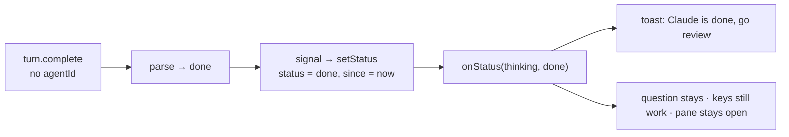

The last step of the loop is deliberately uneventful, and the absence of behaviour is the lesson.

`turn.complete` arrives without an `agentId`, so `parse` maps it to `done`. `signal` records it and
`onStatus` takes the third branch: a toast, and nothing else. The question on screen stays exactly
where it is, with its explanation if it has been answered. The buttons still work. The pane does not
close.

This matters because the alternative was considered and rejected — `docs/flow.md` records it as
"Pause-on-done was dropped from V0 scope." Finishing a question after the agent comes back is still
finishing a question; interrupting the user at that moment would be the plugin fighting them.

The timer stops on its own, because `tick` only redraws while the status is `thinking`. The banner
freezes at its final elapsed time rather than being cleared.

What happens next depends on the user. If they prompt Claude again, `turn.start` fires, the status
goes `done → thinking`, and step 10's branch runs: a new wait is counted, and because the question
on screen has been answered, `advance` serves a fresh one. That is the loop closing.

Two loose ends worth knowing about. An interrupt — pressing Escape — also fires `turn.complete`,
with `reason: 'aborted'`, so an abandoned turn correctly reads as `done` rather than hanging on
`thinking`. And session end needs no cleanup at all: the atoms die with the session, and anything
worth keeping already went to `$.store` at the moment it changed.

---

## Where to go next

- `docs/flow.md` — the same journey as a timeline table.
- `docs/review-notes.md` — things found while reading this code that may warrant a change.
- `plugins/biteq/.claude-plugin/types/claude-code/index.d.ts` — the engine's own API docs, which
  the engine rewrites on every update. The authority for anything in this document.
